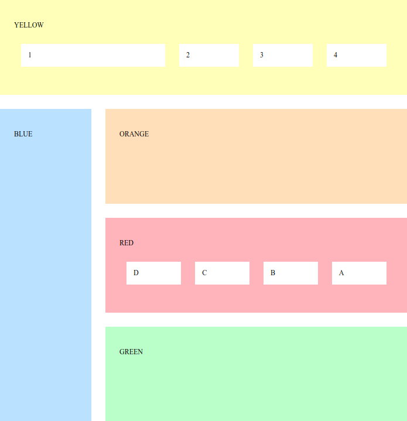

# Oefening
Voorzie voor bijgeleveerde blocks.html pagina de nodige css om onderstaande layout te verkrijgen met flex. Pas indien nodig de html minimaal aan.

* Het eerste item in het geel block is 3 maal de breedte van de andere
* De items in het rode block zijn omgedraaid (D – C – B – A)
* De linkse kolom is 1/4 van de totale breedte

