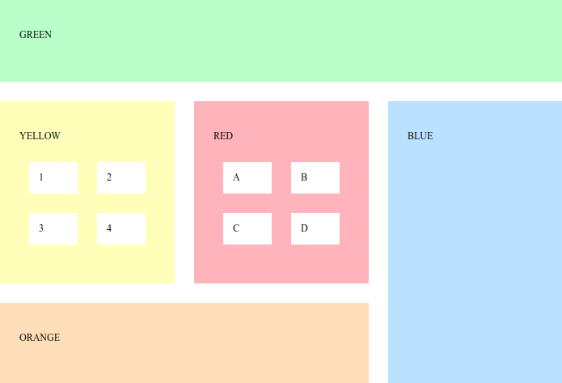

# Oefening
Voorzie voor bijgeleveerde blocks.html pagina de nodige css om onderstaande layout te verkrijgen met flex. Pas indien nodig de html minimaal aan.

* Groene en oranje blokken zijn de helft van de hoogte van de rode en gele blokken

